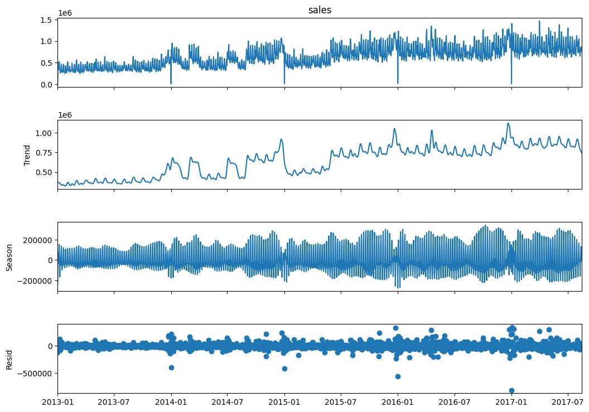
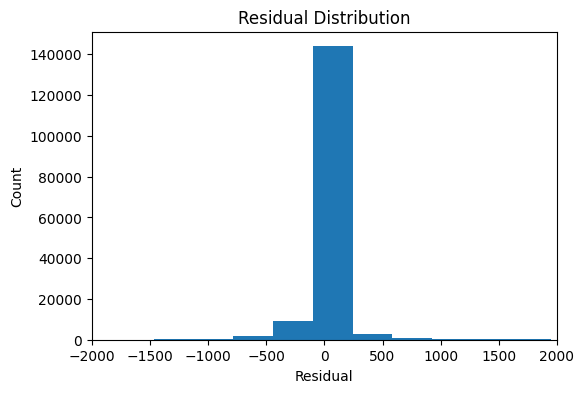

# 小売売上データを用いた需要予測モデル構築

Kaggleの「Store Sales - Time Series Forecasting（Favorita）」データセットを用いて、  
店舗×商品カテゴリ単位の日次売上を予測する短期需要予測モデルを構築しました。

過去売上・販促情報・カレンダー情報を特徴量として活用し、  
LightGBMによる予測モデルを構築するとともに、  
Feature Importance や SHAP によるモデル解釈まで実施しました。

---

## 目次

1. [背景・目的](#1-背景目的)
2. [使用データ](#2-使用データ)
3. [分析フロー](#3-分析フロー)
4. [EDAで確認した主な傾向](#4-edaで確認した主な傾向)
5. [特徴量設計](#5-特徴量設計)
6. [モデル構築と精度評価](#6-モデル構築と精度評価)
7. [ハイパーパラメータ調整](#7-ハイパーパラメータ調整)
8. [モデル解釈](#8-モデル解釈)
9. [予測結果の可視化と残差分析](#9-予測結果の可視化と残差分析)
10. [本分析の限界と今後の改善](#10-本分析の限界と今後の改善)
11. [使用技術](#11-使用技術)
12. [ファイル構成](#12-ファイル構成)
---

## 1. 背景・目的

小売業では、日々の売上変動を踏まえた発注判断や店舗オペレーションの最適化が重要です。  
特に高回転商材では、短期的な需要変動を予測することで、欠品や過剰在庫の抑制につながると考えられます。

本分析では、KaggleのFavorita Store Salesデータを用いて、  
店舗ごと・商品カテゴリごとの日次売上を予測する短期需要予測モデルを構築しました。

また、単に予測精度を高めるだけでなく、Feature Importance や SHAP を用いて、  
どの特徴量が売上予測に寄与しているかを解釈することも目的としています。

---

## 2. 使用データ

- データセット名：Kaggle「Store Sales - Time Series Forecasting」
- URL：https://www.kaggle.com/competitions/store-sales-time-series-forecasting
- 対象期間：2013/01/01 ～ 2017/08/15
- データ件数：約300万件
- 単位：店舗（54店舗） × 商品カテゴリ（33カテゴリ）の日次売上データ
- 目的変数：`sales`

主な使用カラムは以下の通りです。

| カラム名 | 内容 |
|---|---|
| `date` | 日付 |
| `store_nbr` | 店舗ID |
| `family` | 商品カテゴリ |
| `sales` | 売上数量 |
| `onpromotion` | 販促対象商品の数 |

本分析では、`sales` を目的変数として、過去売上・カレンダー情報・販促情報・店舗情報・商品カテゴリ情報をもとに売上を予測しました。

---

## 3. 分析フロー

本Notebookでは、以下の流れで分析を行いました。

1. データ概要の確認
2. 探索的データ分析（EDA）
3. 時系列特徴量・カレンダー特徴量・販促特徴量の作成
4. ベースラインモデルとLightGBMの比較
5. RandomizedSearchCVによるハイパーパラメータ調整
6. Feature Importance / SHAP によるモデル解釈
7. 実測値と予測値の比較
8. 残差分析
9. 今後の改善余地の整理

---

## 4. EDAで確認した主な傾向

EDAでは、売上のトレンド・季節性・販促影響・商品カテゴリごとの差を確認しました。

主な結果は以下の通りです。

- 売上には長期的な増加トレンドが見られた
- ACFおよびSTL分解により、7日周期の季節性が確認された
- 曜日ごとに売上差があり、特に土日の売上が高い傾向が見られた
- 月ごとの売上差があり、特に12月の売上が高い傾向が見られた
- 販促がある場合、平均売上が高くなる傾向が見られた
- 商品カテゴリごとに売上水準が大きく異なっていた

### EDA例：日別売上推移


### EDA例：STL分解



---

## 5. 特徴量設計

EDAで確認した傾向を踏まえ、以下の特徴量を作成しました。

| 特徴量 | 内容 | 導入意図 |
|---|---|---|
| `lag_1` | 前日売上 | 直近の売上水準を反映 |
| `lag_7` | 7日前売上 | 週次周期性を反映 |
| `lag_14` | 14日前売上 | 中期的な売上傾向を反映 |
| `rolling_mean_7` | 直近7日平均売上 | 短期的な売上トレンドを反映 |
| `day_of_week` | 曜日 | 曜日ごとの売上差を反映 |
| `month` | 月 | 月次の季節性を反映 |
| `onpromotion` | 販促対象商品の数 | 販促規模を反映 |
| `is_promo` | 販促有無 | 販促実施有無を補助的に反映 |
| `family` | 商品カテゴリ | 商品カテゴリごとの売上差を識別 |
| `store_nbr` | 店舗ID | 店舗ごとの売上差を識別 |

なお、`lag`特徴量および`rolling`特徴量は、店舗・商品カテゴリごとに作成しました。  
また、`rolling_mean_7` は当日の売上を含めないように、`shift(1)` したうえで作成し、データリークを避けています。

---

## 6. モデル構築と精度評価

本分析では、以下のモデルを比較しました。

- Baseline
- LightGBM
- Tuned LightGBM

時系列データであるため、ランダム分割ではなく日付順でデータを分割しました。

- 学習期間：2013/01/15 ～ 2017/05/17
- テスト期間：2017/05/18 ～ 2017/08/15
- 評価指標：MAE（Mean Absolute Error）

ベースラインモデルには、週次季節性を考慮して「7日前の売上をそのまま予測値とする」方法を採用しました。

### モデル比較結果

| Model | MAE | Improvement |
|---|---:|---:|
| Baseline（lag_7） | 87.77 | - |
| LightGBM | 67.08 | 23.6%改善 |
| Tuned LightGBM | 66.67 | 24.0%改善 |

LightGBMを用いることで、ベースラインと比較してMAEが大きく改善しました。  
この結果から、過去売上・販促情報・カレンダー情報・カテゴリ情報を組み合わせた機械学習モデルの有効性が確認されました。

---

## 7. ハイパーパラメータ調整

LightGBMに対して、`RandomizedSearchCV` によるハイパーパラメータ調整を行いました。

- 使用モデル：`LGBMRegressor`
- 交差検証：`TimeSeriesSplit`
- 評価指標：`neg_mean_absolute_error`
- 探索対象：`n_estimators`, `learning_rate`, `num_leaves`, `max_depth`, `min_child_samples`, `subsample`, `colsample_bytree`

計算時間を考慮し、ハイパーパラメータ探索には学習データの直近1年分を使用しました。  
チューニング後のLightGBMでは、通常のLightGBMと比較してMAEがわずかに改善しました。

| Model | MAE |
|---|---:|
| LightGBM | 67.08 |
| Tuned LightGBM | 66.67 |

改善幅は限定的であり、今回の分析ではハイパーパラメータ調整よりも、  
lag特徴量やrolling特徴量などの特徴量設計が精度に大きく寄与していると考えられます。

---

## 8. モデル解釈

### 8.1 Feature Importance

LightGBMのFeature Importance（gain）を確認したところ、以下の特徴量が特に高い重要度を示しました。

- `rolling_mean_7`
- `lag_7`
- `lag_1`
- `lag_14`
- `day_of_week`


この結果から、売上予測においては、直近の売上水準や週次周期性を表す時系列特徴量が特に重要であることが分かりました。

### 8.2 SHAP

SHAPを用いて、各特徴量が予測値に与える影響の方向性を確認しました。


主な結果は以下の通りです。

- `rolling_mean_7`、`lag_1`、`lag_7` などの時系列特徴量が、予測に大きな影響を与えていた
- これらの特徴量の値が高い場合、予測値を押し上げる傾向が見られた
- 販促情報や曜日情報も一定の影響を持つが、時系列特徴量と比較すると寄与は限定的だった
- `family` や `store_nbr` も予測に一定の影響を与えているが、今回のモデルでは過去売上に関する特徴量と比較すると相対的な寄与は小さかった

Feature Importance と SHAP の両方から、今回のモデルは主に過去売上の時系列構造を学習していることが確認されました。

---

## 9. 予測結果の可視化と残差分析

### 9.1 実測値と予測値の比較

テスト期間における実測値と予測値を日別に集計し、時系列で比較しました。


全体的なトレンドや週次の周期性は概ね再現できていました。  
一方で、売上ピーク時にはやや過小評価が見られ、突発的な需要変動までは十分に捉えきれていないことが確認されました。

### 9.2 残差分析

予測誤差の分布を確認するため、残差（実測値 − 予測値）をヒストグラムで可視化しました。



残差は0付近に集中しており、全体として大きなバイアスは見られませんでした。  
一方で、一部に大きな誤差が存在しており、突発的な需要変動や外部要因による売上変化を十分に捉えきれていない可能性があります。

---

## 10. 本分析の限界と今後の改善

### 10.1 外部特徴量の不足

本分析では、主に過去売上・販促情報・カレンダー情報を用いて予測を行いました。  
一方で、売上に影響を与える可能性がある以下の外部情報は使用していません。

- 祝日情報
- 店舗情報
- 地域イベント情報
- 天候情報
- 原油価格などのマクロ要因

これらを特徴量として追加することで、ピーク時や急激な売上変動の予測精度向上が期待されます。

### 10.2 予測期間の設計

本分析では、過去売上を用いた短期需要予測を想定しています。  
そのため、`lag_1` や `rolling_mean_7` など、直近の売上情報を利用できる前提で特徴量を作成しています。

実務でより長期の売上を予測する場合は、予測時点で利用可能な情報を整理し、  
再帰予測や多段階予測など、予測期間に応じた設計が必要になります。

### 10.3 施策効果の検証

本分析では、売上予測モデルの構築とモデル解釈を中心に行いました。  
実務で活用する場合は、予測結果をもとにした発注量の最適化、在庫削減効果、欠品率の低下などを検証する必要があります。

---

## 11. 使用技術

本分析では、以下の技術・ライブラリを使用しました。

| 分類 | 使用技術 |
|---|---|
| 言語 | Python |
| データ処理 | pandas, numpy |
| 可視化 | matplotlib, seaborn |
| 時系列分析 | statsmodels |
| 前処理・モデル評価 | scikit-learn |
| 機械学習モデル | LightGBM |
| ハイパーパラメータ調整 | RandomizedSearchCV, TimeSeriesSplit |
| モデル解釈 | Feature Importance, SHAP |
| 実行環境 | Google Colab |
| バージョン管理・公開 | GitHub |

---

## 12. ファイル構成

```text
retail-demand-forecast/
├── README.md
├── 需要予測PF.ipynb
└── images/
    ├── actual_vs_pred.png
    ├── feature_importance.png
    ├── residual_distribution.png
    ├── sales_trend.png
    ├── shap_summary.png
    └── stl_decomposition.png

---
