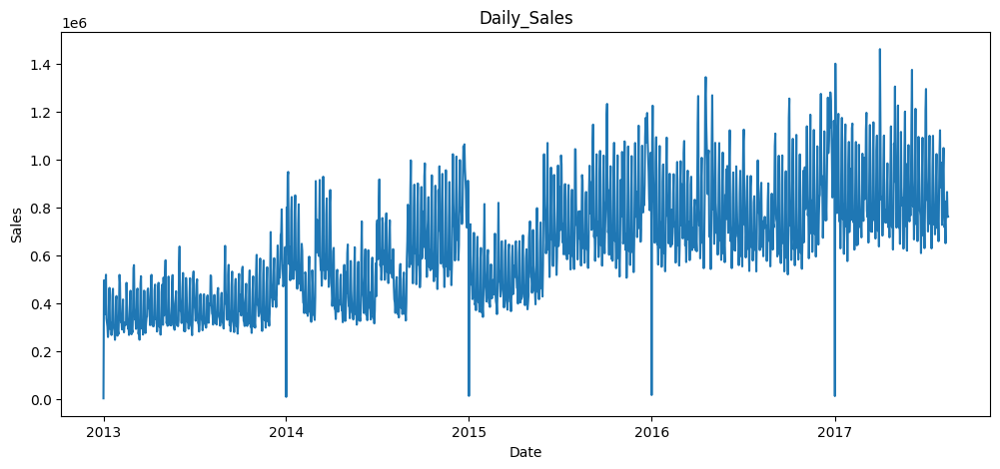
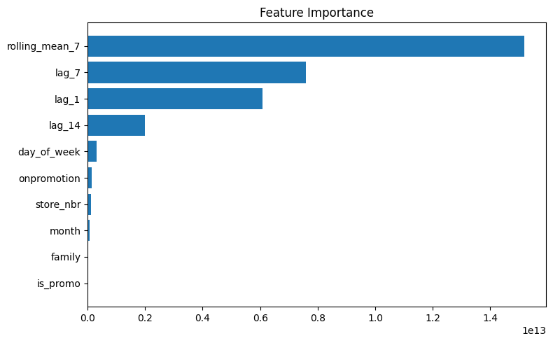
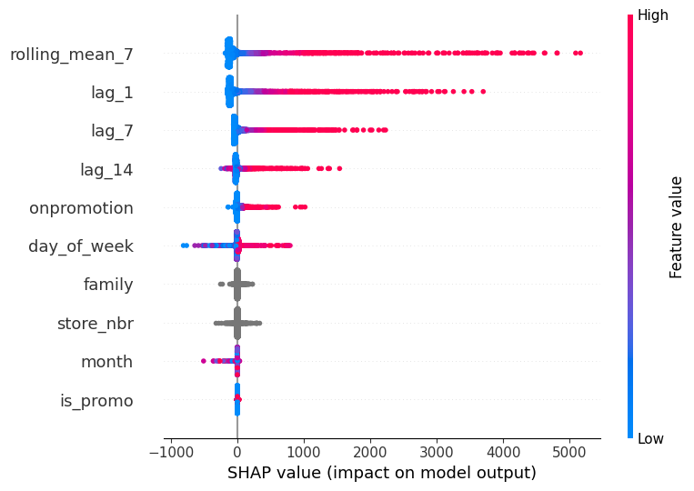
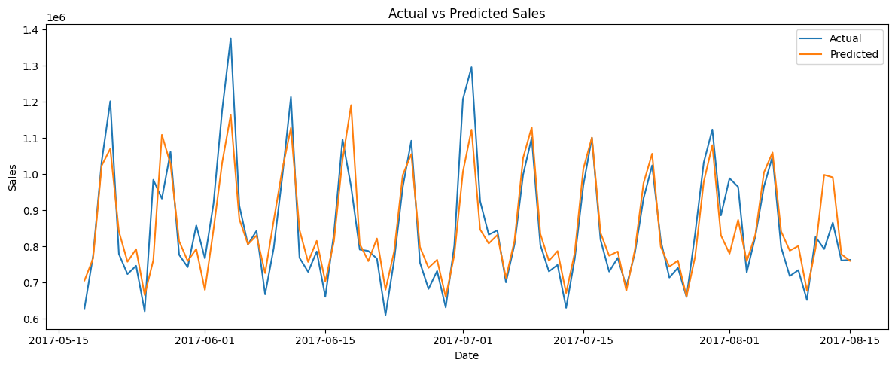

# 小売売上データを用いた需要予測モデル構築

Kaggleの「Store Sales - Time Series Forecasting（Favorita）」データセットを用いて、  
店舗×商品カテゴリ単位の日次売上を予測する短期需要予測モデルを構築しました。

過去売上・販促情報・カレンダー情報を特徴量として活用し、  
LightGBMによる予測モデルを構築するとともに、  
特徴量重要度およびSHAPによるモデル解釈まで実施しています。

---

## 1. 背景・目的

小売業では、日々の売上変動を踏まえた発注判断や店舗オペレーションの最適化が重要です。  
特に高回転商材では、短期的な需要変動を予測することで、欠品や過剰在庫の抑制につながると考えられます。

本分析では、KaggleのFavorita Store Salesデータを用いて、  
店舗ごと・商品カテゴリごとの売上を予測する短期需要予測モデルを構築し、  
どの特徴量が予測に有効であるかを検証しました。

---

## 2. 使用データ

- データセット：Kaggle「Store Sales - Time Series Forecasting」
- 対象期間：2013/01/01 ～ 2017/08/15
- データ件数：約300万件
- 単位：店舗（54店舗） × 商品カテゴリ（33カテゴリ）の日次売上データ

主な使用カラム

| カラム名 | 内容 |
|---------|------|
| date | 日付 |
| store_nbr | 店舗ID |
| family | 商品カテゴリ |
| sales | 売上数量 |
| onpromotion | 販促対象商品の数 |

---

## 3. 分析フロー

1. 探索的データ分析（EDA）による売上構造の把握
2. 時系列特徴量・カレンダー特徴量・販促特徴量の作成
3. ベースラインモデルとLightGBMによる予測精度比較
4. RandomizedSearchCVによるハイパーパラメータ調整
5. 特徴量重要度・SHAPによるモデル解釈
6. 予測結果の可視化および残差分析

---

## 4. 売上推移の確認

全体売上推移を確認すると、長期的な増加トレンドに加え、短期的な規則的変動が見られました。  
このことから、売上には時系列性が存在すると判断しました。

---

## 5. 特徴量設計

EDAおよび自己相関分析の結果を踏まえ、以下の特徴量を作成しました。

| 特徴量 | 内容 | 導入意図 |
|-------|------|---------|
| lag_1 | 前日売上 | 直近の売上水準を反映 |
| lag_7 | 7日前売上 | 週次周期性を反映 |
| lag_14 | 14日前売上 | 中期的な売上傾向を反映 |
| rolling_mean_7 | 直近7日平均売上 | 売上トレンドを平滑化して反映 |
| day_of_week | 曜日 | 曜日ごとの売上差を反映 |
| month | 月 | 月次の季節性を反映 |
| onpromotion | 販促対象商品の数 | 販促規模を反映 |
| is_promo | 販促有無 | 販促実施有無を補助的に反映 |
| family | 商品カテゴリ | 商品カテゴリ差を識別 |
| store_nbr | 店舗ID | 店舗差を識別 |

---

## 6. モデル構築と精度評価

ベースラインとして7日前売上（lag_7）をそのまま予測値とする単純モデルを設定し、  
LightGBMとの予測精度を比較しました。

| Model | MAE | Improvement |
|------|------:|------------:|
| Baseline（lag_7） | 87.77 | - |
| LightGBM | 67.08 | 23.6%改善 |
| Tuned LightGBM | 66.67 | 24.0%改善 |

ベースラインと比較してMAEが大きく改善しており、  
複数特徴量を活用した機械学習モデルの有効性が確認されました。

---

## 7. Feature Importance

特徴量重要度（gain）を確認すると、rolling_mean_7、lag_7、lag_1といった  
時系列特徴量が特に高い寄与を示しました。

このことから、売上予測においては直近の売上推移および週次周期性が  
中心的な説明要因となっていることが分かりました。

---

## 8. SHAPによるモデル解釈

SHAPによる可視化でも、rolling_mean_7やlag_1、lag_7の値が高いほど  
予測値を押し上げる傾向が確認されました。

一方で、販促情報やカテゴリ変数は補助的な寄与に留まっており、  
本モデルが主に過去売上の時系列構造を学習していることが読み取れます。

---

## 9. 予測結果の可視化

実測値と予測値を比較すると、全体的なトレンドおよび週次の周期性は概ね再現できています。

一方で、売上ピーク時にはやや過小評価が見られ、  
突発的な需要変動までは十分に捉えきれていないことが確認されました。

---

## 10. 考察・今後の改善余地

本分析では、過去売上に基づく基本的な短期需要予測モデルを構築し、  
時系列特徴量が売上予測に対して強い説明力を持つことを確認しました。

一方で、ピーク時の誤差が残っていることから、

- 祝日情報
- 天候情報
- 地域イベント情報

などの外部特徴量を追加することで、さらなる精度向上が期待されます。

---

## 11. 使用技術

- Python
- pandas
- numpy
- matplotlib
- seaborn
- statsmodels
- scikit-learn
- LightGBM
- SHAP

---

## 12. Notebook

分析の詳細は以下のNotebookに記載しています。

- [需要予測PF_20260426.ipynb](./需要予測PF_20260426.ipynb)
